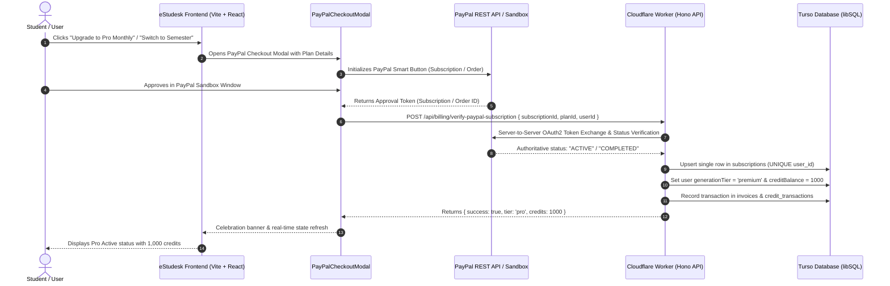

# eStudesk System Walkthrough & Architectural Reference

---

## 1. Executive Summary & Major Implementations

eStudesk is a modern, privacy-first academic workspace featuring intelligent AI study generation, multi-channel deadline tracking, dynamic database-driven subscription tiers, and server-verified PayPal checkout.

### Key Highlights of Recent Implementations:
1. **Full-Page Account, Settings & Billing Center** ([AccountSettingsPage.tsx](file:///d:/antigravity/estudesk-bolt.new/estudesk-bolt.new/src/components/AccountSettingsPage.tsx))
   - Dedicated full-page route (`view.kind === 'account'`) with top navigation bar and `"← Back to Dashboard"` return button.
   - Member-since date pill (`Member since Sep 2026`) and cloud synchronization status badge.
   - Clean 5-tab workspace: **Profile & Identity**, **Plans & Upgrades**, **AI Credits & Meter**, **Invoices & Receipts**, and **Privacy & GDPR**.
2. **Database-Driven Dynamic Pricing & Plans** ([apps/api/src/db/schema.ts](file:///d:/antigravity/estudesk-bolt.new/estudesk-bolt.new/apps/api/src/db/schema.ts))
   - Stored in Turso libSQL `subscription_plans` table with dynamic prices, discounts, strikethroughs, discount stamp reasons, and active/inactive ("Coming Soon") toggles.
   - **Free Scholar**: $0.00 — 100 Initial AI credits, standard study tools.
   - **Pro Monthly**: $9.99 / mo — 1,000 monthly AI credits, all 7 study formats, OCR extractions, 24h deadline alerts, priority queue.
   - **Pro Semester (4 Months)**: $29.99 / 4 mo (~$7.49/mo) — 25% discount with `<del>$39.99</del>` strikethrough and `"🔥 SEMESTER SAVER • 25% OFF"` badge.
   - **Pro Yearly**: $79.99 / yr (`isActive: false`) — Dynamically displayed as **"Coming Soon"** with disabled checkout while retaining full database specifications.
3. **Strict 1:1 Subscription Model & Database Deduplication** ([apps/api/src/billing/billing.ts](file:///d:/antigravity/estudesk-bolt.new/estudesk-bolt.new/apps/api/src/billing/billing.ts))
   - Clean separation of concerns:
     - `subscriptions`: Exactly 1 row per user containing current active plan, renewal status, and expiration dates. Enforced by `UNIQUE(user_id)`.
     - `invoices`: Permanent historical audit ledger of all receipts and transactions.
     - `credit_transactions`: Complete credit deduction and grant history.
   - In-place `UPDATE` (Upsert) operations so switching plans updates the single user row instead of creating duplicate records.
4. **PayPal Checkout Modal & Server-to-Server Verification** ([PayPalCheckoutModal.tsx](file:///d:/antigravity/estudesk-bolt.new/estudesk-bolt.new/src/components/PayPalCheckoutModal.tsx))
   - Dynamic PayPal JS SDK loader supporting both Subscription mode (`intent=subscription`) and Order mode (`intent=capture`).
   - Zero-trust server verification (`POST /api/billing/verify-paypal-subscription`) validating subscription/order status directly with PayPal REST API OAuth2 servers before upgrading user tiers.
   - Webhook listener (`POST /api/billing/paypal-webhook`) for renewals, suspensions, and cancellations.
   - **Instant Sandbox Test Mode** for seamless developer testing without popup blockers.
5. **Period-Preserved Downgrades & Fixed Monthly Quota**
   - **Downgrading to Free**: Keeps full Pro benefits and all credits active until `currentPeriodEnd` (`cancelAtPeriodEnd = true`) with a `"Resume Auto-Renewal"` action.
   - **Immediate Upgrades**: Grants Pro tier instantly with fixed 1,000 monthly credits (`setUserMonthlyQuota`) to prevent runaway credit stacking.
6. **Developer Tools & Turso CLI Scripts**
   - **In-App Testing Controls**: 1-click `"Reset to Free (100 Cr)"` and `"Set Pro (1,000 Cr)"` buttons under AI Credits tab.
   - **CLI Tool** ([scripts/reset-user.mjs](file:///d:/antigravity/estudesk-bolt.new/estudesk-bolt.new/scripts/reset-user.mjs)): `node scripts/reset-user.mjs <email_or_id> [tier] [credits]`.
   - **Deduplication Tool** ([scripts/cleanup-subscriptions.mjs](file:///d:/antigravity/estudesk-bolt.new/estudesk-bolt.new/scripts/cleanup-subscriptions.mjs)): Cleans legacy duplicate subscription rows and applies unique database index.

---

## 2. System Architecture & Subscription Flow



---

## 3. Account Settings Navigation & Tabs

The settings experience is organized into 5 dedicated, high-focus tabs:

```
┌────────────────────────────────────────────────────────────────────────────────────────┐
│  ← Back to Dashboard   / Account & Billing              [Md Hasan Imam | Sep 2026] [PRO]│
├────────────────────────────────────────────────────────────────────────────────────────┤
│  [Profile & Identity]  [Plans & Upgrades]  [AI Credits & Meter]  [Invoices]  [Privacy] │
└────────────────────────────────────────────────────────────────────────────────────────┘
```

### 1. Profile & Identity
- **Full Name & Avatar**: Custom initials avatar with gradient styling.
- **Academic Metadata**: University / Institution, Major / Field of Study, Academic Bio & Target Goals.
- **Preferred Timezone**: Timezone selector with 1-click **"Auto-detect local"** button for accurate deadline alerts.
- **Synced to Cloud**: Saves directly to Turso DB via `POST /api/user/profile`.

### 2. Plans & Upgrades
- **Active Subscription Status Banner**:
  - Displays plan tier (**Free**, **Pro Monthly**, or **Pro Semester**).
  - Displays renewal date or scheduled downgrade date (`"Cancels at Period End on [Date]"`).
  - Action buttons: **"Cancel Auto-Renewal"** or **"Resume Auto-Renewal"**.
- **Dynamic Database Plans Grid**:
  - `ACTIVE` badge on user's current plan with disabled click action.
  - Context-aware action buttons: `"Upgrade to Pro"`, `"Switch to Semester (Save 10%)"`, `"Switch to Monthly Plan"`, or `"Downgrade to Free"`.
  - Strikethrough pricing for discounted plans with top stamp badges.
  - "Coming Soon" badge for inactive yearly plans.

### 3. AI Credits & Meter
- **Live AI Credit Balance Meter**: Large numerical display with monthly limit indicator.
- **Visual Study Format Cost Breakdown**:
  - Study Notes / Cheatsheet: `2 Credits`
  - Quiz / Flashcards: `2 Credits`
  - Infographic / Slides / Assignments: `5 Credits`
  - Ask AI Question: `1 Credit`
- **Credit Transactions & Audit History**: Real-time ledger of every credit spend, subscription grant, or bonus.
- **Developer Testing Controls**: 1-click buttons to test resets (`Reset to Free (100 Cr)`) and Pro overrides (`Set Pro (1,000 Cr)`).

### 4. Invoices & Receipts
- **Billing History Table**: Lists invoice number, plan name, amount, billing period, and status.
- **Official University Expense PDF Generator**: 1-click download of styled academic receipts generated client-side via `jspdf` for university expense reimbursement.

### 5. Privacy & GDPR
- **Student Data Archive (.json)**: 1-click export of semesters, subjects, study notes, flashcards, quizzes, and chat transcripts.
- **Account Deletion**: 30-day soft deletion request with confirmation modal.

---

## 4. Environment Variables & Secrets Reference

### A. Frontend Environment Variables (`.env` / Cloudflare Pages)

| Variable | Required | Description | Example |
| :--- | :---: | :--- | :--- |
| `VITE_API_BASE_URL` | Optional | Custom backend API URL. Defaults to relative `/api` or Workers URL. | `https://estudesk-api.rifa-numis.workers.dev` |
| `VITE_PAYPAL_CLIENT_ID` | **Yes** | PayPal REST API Client ID (Sandbox or Live). | `Afq3...` |
| `VITE_TURNSTILE_SITE_KEY`| **Yes** | Cloudflare Turnstile Site Key for bot challenge. | `0x4AAAAAAEv7GppzDudNBQvY` |
| `VITE_AI_API_KEY` | Optional | Direct client-side AI fallback key (if not using Worker router). | `sk-...` |
| `VITE_AI_BASE_URL` | Optional | Direct client AI API endpoint. | `https://api.deepseek.com/v1` |
| `VITE_AI_MODEL` | Optional | Default AI model identifier. | `deepseek-chat` |

---

### B. Backend Cloudflare Worker Variables & Secrets (`apps/api`)

#### 1. Plain Text Variables (`vars` in [apps/api/wrangler.json](file:///d:/antigravity/estudesk-bolt.new/estudesk-bolt.new/apps/api/wrangler.json))
These variables are synchronized automatically across every deployment:

```json
{
  "vars": {
    "ENVIRONMENT": "production",
    "TURSO_DATABASE_URL": "libsql://estudesk-db-drhimam.aws-us-east-2.turso.io",
    "AI_PROVIDER": "deepseek",
    "AI_BASE_URL": "https://api.deepseek.com/v1",
    "AI_MODEL": "deepseek-chat",
    "ZEPTOMAIL_API_URL": "https://api.zeptomail.ca/v1.1/email",
    "EMAIL_FROM_ADDRESS": "info@estudesk.com",
    "EMAIL_FROM_NAME": "eStudesk",
    "FRONTEND_URL": "https://estudesk.com",
    "PAYPAL_ENVIRONMENT": "sandbox"
  }
}
```

#### 2. Encrypted Secrets (`Type: Secret` in Cloudflare Dashboard or via `wrangler secret put`)
These secrets are securely stored in Cloudflare's vault and **never deleted or overwritten by deployments**:

| Secret Name | Required | Purpose | How to Set via CLI |
| :--- | :---: | :--- | :--- |
| `TURSO_AUTH_TOKEN` | **Yes** | Authentication token for Turso libSQL database. | `npx wrangler secret put TURSO_AUTH_TOKEN` |
| `BETTER_AUTH_SECRET` | **Yes** | Secret key for Better-Auth JWT token signing and session hashing. | `npx wrangler secret put BETTER_AUTH_SECRET` |
| `PAYPAL_CLIENT_ID` | **Yes** | PayPal Developer Client ID. | `npx wrangler secret put PAYPAL_CLIENT_ID` |
| `PAYPAL_CLIENT_SECRET` | **Yes** | PayPal Developer Secret for OAuth2 token generation. | `npx wrangler secret put PAYPAL_CLIENT_SECRET` |
| `PAYPAL_WEBHOOK_ID` | Optional | Webhook ID from PayPal Dashboard for verifying webhook signatures. | `npx wrangler secret put PAYPAL_WEBHOOK_ID` |
| `CLOUDFLARE_TURNSTILE_SECRET_KEY` | **Yes** | Secret key to verify Turnstile CAPTCHA challenge tokens. | `npx wrangler secret put CLOUDFLARE_TURNSTILE_SECRET_KEY` |
| `ZEPTOMAIL_API_KEY` | Optional | SendMail Token for Zoho ZeptoMail transactional email delivery. | `npx wrangler secret put ZEPTOMAIL_API_KEY` |
| `AI_API_KEY` | **Yes** | API key for DeepSeek / Mimo / OpenAI generation engine. | `npx wrangler secret put AI_API_KEY` |

---

## 5. PayPal Sandbox Testing Guide

### Step 1: Obtain Sandbox Accounts
1. Go to [PayPal Developer Dashboard](https://developer.paypal.com/dashboard/accounts).
2. Go to **Testing Tools > Sandbox Accounts**:
   - **Business Account** (`...-facilitator@...`): Used to get your `PAYPAL_CLIENT_ID` and `PAYPAL_CLIENT_SECRET`.
   - **Personal Account** (`...-buyer@...`): Used as the test student buyer with dummy funds and pre-loaded test credit cards.

### Step 2: Testing Subscriptions in eStudesk
1. Open eStudesk and navigate to **Account & Settings > Plans & Upgrades**.
2. Click **Upgrade to Pro Monthly** or **Upgrade to Pro Semester**.
3. In the popup modal:
   - **Option A (PayPal Smart Button)**: Click the yellow PayPal button, log in using your **Sandbox Personal (Buyer)** test account, and click **Agree & Subscribe**.
   - **Option B (Instant Sandbox Test)**: Click **⚡ Instant Sandbox Test Subscription** to instantly simulate the verified approval pipeline.
4. The modal shows the celebration checkmark, unlocks Pro benefits immediately, and sets the credit balance to 1,000 credits.

### Step 3: Testing Plan Downgrade & Period Preservation
1. Click **Downgrade to Free** on the Free plan card.
2. Confirm the prompt:
   > *"Are you sure you want to downgrade to Free? Your Pro plan and credits will remain active until the end of your billing cycle on [Date]..."*
3. The plan updates with a `"Cancels at Period End on [Date]"` tag and a **"Resume Auto-Renewal"** button. Full Pro access and credits remain active until that date.

---

## 6. Database Management & CLI Commands

### 1. User Reset & Usage Override Tool ([scripts/reset-user.mjs](file:///d:/antigravity/estudesk-bolt.new/estudesk-bolt.new/scripts/reset-user.mjs))
```bash
# List all registered users in Turso DB
node scripts/reset-user.mjs

# Reset a single user to Free tier with 100 credits
node scripts/reset-user.mjs vendem.dk@gmail.com free 100

# Override a user to Pro tier with custom credits (e.g. 2,500 credits)
node scripts/reset-user.mjs vendem.dk@gmail.com pro 2500

# Reset ALL users in the database to Free with 100 credits
node scripts/reset-user.mjs all free 100
```

### 2. Subscription Deduplication Tool ([scripts/cleanup-subscriptions.mjs](file:///d:/antigravity/estudesk-bolt.new/estudesk-bolt.new/scripts/cleanup-subscriptions.mjs))
```bash
# Deduplicate subscription rows and enforce 1:1 unique index
node scripts/cleanup-subscriptions.mjs
```

### 3. Direct SQL Queries (Turso CLI / Web Shell)
```sql
-- Reset user tier and credits
UPDATE user 
SET generation_tier = 'free', credit_balance = 100, updated_at = CURRENT_TIMESTAMP 
WHERE email = 'vendem.dk@gmail.com';

-- Cancel all active subscriptions for a user
UPDATE subscriptions 
SET status = 'canceled', cancel_at_period_end = 0, updated_at = CURRENT_TIMESTAMP 
WHERE user_id = (SELECT id FROM user WHERE email = 'vendem.dk@gmail.com');

-- Inspect current active subscriptions
SELECT s.id, u.email, s.plan_id, s.status, s.current_period_end 
FROM subscriptions s 
JOIN user u ON s.user_id = u.id;
```

---

## 7. Landing Page Enhancements (Pricing & Modern Academic Footer)

- **Interactive `#pricing` Section**:
  - **Free Scholar**: $0/forever with 100 Initial AI credits, Dexie.js offline-first local + cloud sync, 3D Flashcards, 1-by-1 Quiz Tester, 432Hz focus timer.
  - **Pro Monthly**: $9.99/mo with 1,000 monthly credits, all 7 study modes (LaTeX Slides, Infographics, Cheatsheets), OCR lecture capture, and 24h deadline alerts.
  - **Pro Semester (4 Months)**: $29.99/4mo (`🔥 SEMESTER SAVER • 25% OFF`), $7.49/month breakdown for uninterrupted midterm and finals coverage.
  - **Pro Yearly**: $79.99/yr preview ("Coming Soon").
  - Intelligent CTAs routing guest users to `openAuthModal('signup')` and logged-in users directly to `setView({ kind: 'account', tab: 'subscription' })`.
- **Modern Multi-Column Footer**:
  - Academic Suite navigation (AI Note Studio, 3D Flashcards, Quiz Tester, OCR, 432Hz Audio).
  - Plans & Billing links.
  - Trust & Privacy indicators (GDPR Data Portability, Scrypt Encryption, Cloudflare Turnstile).
  - Official contact email (`info@estudesk.com`) and GitHub repository links.

## 8. Build, Verification & Deployment

```bash
# 1. Run TypeScript typecheck
npm run typecheck

# 2. Build production Vite bundle
npm run build

# 3. Deploy API Worker to Cloudflare
npm run deploy:api

# 4. Deploy Frontend Pages to Cloudflare
npm run deploy:pages
```

---
*Last Updated: September 2026 • eStudesk Engineering Documentation*