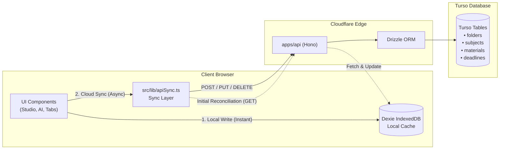

# Developer Walkthrough & Architecture Guide — `estudesk-bolt.new`

Welcome to **eStudesk** (`estudesk-bolt.new`)! This document provides an exhaustive, step-by-step technical guide for developers working on or inheriting this codebase. It details the architecture, file hierarchy, database schemas, component contracts, implementation history, and developer commands.

> [!IMPORTANT]
> **Mandatory Implementation Rule**: Whenever any feature, bug fix, API route, component update, or refactoring is implemented, it **MUST be documented in this `WALKTHROUGH.md` file** at the end of the implementation phase before declaring completion. Project memory rules are persisted in [`PROJECT_MEMORY.md`](file:///d:/antigravity/estudesk-bolt.new/estudesk-bolt.new/PROJECT_MEMORY.md).

---

## 1. Product Identity & Philosophy

**eStudesk** is a standalone, privacy-first study preparation platform for students. It is designed around focus, speed, and zero vendor lock-in.

- **Core User Flow**: Attach source materials (PDFs, text notes, URLs, images, audio, video) $\rightarrow$ select study material type $\rightarrow$ generate structured material in 1 click $\rightarrow$ refine conversationally with a 10-turn capped studio $\rightarrow$ save and review offline.
- **Privacy First**: Chat messages, drafts, and attachments are cached client-side in **IndexedDB (Dexie.js)**. Auth runs in your own Cloudflare Worker via **Better Auth** backed by **Neon Postgres**.

---

## 2. Technical Stack Overview

| Layer | Technology | Key Details |
| :--- | :--- | :--- |
| **Frontend Framework** | React 18 + Vite | Strict TypeScript 5+, ESM modules |
| **Styling & Icons** | Tailwind CSS 3.4 + Lucide React | Custom color design system (`paper`, `ink`, `accent`, `crimson`), custom fonts |
| **Client Database** | Dexie.js (IndexedDB v3) | Offline storage for semesters, subjects, materials, deadlines, chat sessions |
| **Backend API** | Cloudflare Workers + Hono | Edge HTTP framework, CORS, structured JSON logging, strict Zod middleware |
| **Database & ORM** | Turso (libSQL/SQLite at Edge) + Drizzle ORM | `@libsql/client` HTTP driver, 18-table relational schema (9GB free storage, 500 DBs) |
| **Auth Engine** | Better Auth | Self-hosted inside Worker, Drizzle SQLite adapter, scrypt password hashing |
| **AI Processing** | Multi-Provider AI Router | Tested & verified with Xiaomi MiMo (`mimo-v2.5-pro` at `https://api.xiaomimimo.com/v1`) |
| **OCR & Media** | Tesseract.js | Client-side Optical Character Recognition for uploaded image notes |
| **Rendering Engines** | KaTeX, React Markdown, DOMPurify | LaTeX math expressions, GitHub Flavored Markdown callouts, sandboxed HTML |
| **Export Engine** | Browser Print Engine + Print CSS | High-contrast, publication-grade PDF exporter with native page counters |

---

## 3. Directory Structure & Key Files

```
estudesk-bolt.new/
├── src/
│   ├── components/
│   │   ├── AskAIPanel.tsx          # Collapsible/resizable AI chat drawer with web context
│   │   ├── GenerationStudio.tsx    # 10-turn multi-format generation & refinement studio
│   │   ├── MaterialViewer.tsx      # Comprehensive viewer: 3D Flashcards, 1-by-1 Quiz, Slides, Notes
│   │   ├── StudyMaterialTab.tsx    # Subject study materials organizer with sub-tabs
│   │   ├── SemesterTabs.tsx        # Semester switcher & subject card browser
│   │   ├── DeadlineList.tsx        # Exam & assignment countdown calendar
│   │   └── GlobalSearch.tsx        # Command-K quick jump across materials & notes
│   ├── utils/
│   │   ├── pdfExport.ts            # Executive PDF export engine supporting all study formats
│   │   ├── webReader.ts            # Jina Reader web extractor for URL context in AI prompts
│   │   ├── aiClient.ts             # Client-side AI router communicating directly with providers
│   │   └── colors.ts               # Curated HSL subject palette tokens and color utilities
│   ├── hooks/
│   │   └── useQueries.ts           # Dexie reactive live queries for reactive UI updates
│   ├── db/
│   │   └── database.ts             # Dexie.js IndexedDB schema and client store definitions
│   ├── types/
│   │   └── index.ts                # TypeScript domain models (Flashcards, Quizzes, Materials)
│   ├── App.tsx                     # Main layout shell with resizable split-pane & persistence
│   └── index.css                   # Global design tokens, typography, and 3D card perspective classes
├── apps/api/                       # Cloudflare Worker backend
│   ├── src/
│   │   ├── index.ts                # Hono edge router & API middleware
│   │   ├── db/schema.ts            # Drizzle ORM PostgreSQL schema
│   │   └── lib/auth.ts             # Better Auth configuration
│   └── .dev.vars                   # Worker environment secrets
├── WALKTHROUGH.md                  # Comprehensive developer guide (this file)
└── PROJECT_MEMORY.md               # Persistent project decisions & rules
```

---

## 4. Environment Variables Configuration

```env
# Database Connection (Turso libSQL / SQLite at the Edge)
TURSO_DATABASE_URL=libsql://your-db-org.turso.io
TURSO_AUTH_TOKEN=your_turso_auth_token
DATABASE_URL=libsql://your-db-org.turso.io

BETTER_AUTH_SECRET=your_better_auth_secret_32_characters_long
BETTER_AUTH_URL=http://localhost:3000

# Active AI Provider Configuration
AI_PROVIDER=custom
AI_API_KEY=your_ai_api_key_here
AI_BASE_URL=https://api.xiaomimimo.com/v1
AI_MODEL=mimo-v2.5-pro

# Vite AI Client Keys
VITE_AI_PROVIDER=custom
VITE_AI_API_KEY=your_ai_api_key_here
VITE_AI_BASE_URL=https://api.xiaomimimo.com/v1
VITE_AI_MODEL=mimo-v2.5-pro

R2_BUCKET=estudesk-sources
```

---

## 5. Detailed Implementation Log (What Was Done & How It Was Done)

### 1. Live Ask AI Integration & Chronological Message Ordering
- **What was done**: Replaced canned hardcoded mock responses with live API completions calling the Xiaomi MiMo endpoint (`mimo-v2.5-pro`). Fixed a message grouping issue where user inputs and AI replies appeared out of chronological order.
- **How it was done**:
  - Direct AI routing in [`src/utils/aiClient.ts`](file:///d:/antigravity/estudesk-bolt.new/estudesk-bolt.new/src/utils/aiClient.ts) reading `VITE_AI_*` environment variables.
  - In [`src/hooks/useQueries.ts`](file:///d:/antigravity/estudesk-bolt.new/estudesk-bolt.new/src/hooks/useQueries.ts), updated `useConversationMessages` to query IndexedDB with `.sortBy('createdAt')` ensuring strict chronological timestamp order.
  - Added animated `isThinking` indicator (*"Thinking and analyzing context..."*) during API roundtrips.

### 2. Live Web URL Context Extraction (`src/utils/webReader.ts`)
- **What was done**: Solved the issue where providing URLs (e.g. `https://www.echocardiographer.org/sound-wave-basics`) resulted in the AI asking for text because it couldn't read web links.
- **How it was done**:
  - Implemented [`src/utils/webReader.ts`](file:///d:/antigravity/estudesk-bolt.new/estudesk-bolt.new/src/utils/webReader.ts) using **Jina Reader** (`https://r.jina.ai/{url}`) to convert web pages into clean, token-efficient Markdown.
  - Built an automatic URL regex detector (`extractUrls`) in [`src/components/AskAIPanel.tsx`](file:///d:/antigravity/estudesk-bolt.new/estudesk-bolt.new/src/components/AskAIPanel.tsx) and [`src/components/GenerationStudio.tsx`](file:///d:/antigravity/estudesk-bolt.new/estudesk-bolt.new/src/components/GenerationStudio.tsx) that transparently extracts web contents and injects them as authoritative context in prompt payloads.

### 3. Resizable Ask AI Split-Pane with Drag Handle
- **What was done**: Gave users the ability to smoothly resize the Ask AI side panel from 320px up to 720px with real-time mouse dragging and persistent width across browser refreshes.
- **How it was done**:
  - Modified [`src/App.tsx`](file:///d:/antigravity/estudesk-bolt.new/estudesk-bolt.new/src/App.tsx) with a custom drag separator handle (`w-1.5 hover:bg-accent-400 cursor-col-resize`).
  - Added global `mousemove` and `mouseup` window event listeners calculating `window.innerWidth - e.clientX`, clamped between `320px` and `720px`.
  - Persisted the chosen panel width in `localStorage.getItem('estudesk_ask_ai_width')`.

### 4. Strict Enforcement of Generation Studio Configuration Parameters
- **What was done**: Ensured that all user settings configured in Generation Studio's left panel (word count, question count, difficulty, detail level, format, tone, citation style, and extra instructions) are strictly enforced by the AI rather than ignored.
- **How it was done**:
  - Upgraded prompt synthesis in [`src/utils/aiClient.ts`](file:///d:/antigravity/estudesk-bolt.new/estudesk-bolt.new/src/utils/aiClient.ts) and [`src/components/GenerationStudio.tsx`](file:///d:/antigravity/estudesk-bolt.new/estudesk-bolt.new/src/components/GenerationStudio.tsx) with mandatory directives for every configuration key.
  - Formatted JSON response schemas for structured material types (`quiz`, `flashcards`, `presentation`, `infographic`) to prevent model hallucination.

### 5. High-Standard, Non-Faded PDF Download Engine for All Materials
- **What was done**: Implemented a publication-grade print-to-PDF export utility supporting all 8 study material types (`notes`, `cheatsheet`, `flashcards`, `quiz`, `assignment`, `presentation`, `infographic`, `other`). The exported documents feature crisp vector typography, visible page numbers, subject-themed color accents, and prominent callouts with **zero faded gray colors**.
- **How it was done**:
  - Created [`src/utils/pdfExport.ts`](file:///d:/antigravity/estudesk-bolt.new/estudesk-bolt.new/src/utils/pdfExport.ts):
    - Configured `@page` CSS with standard 16mm margins and native CSS counters `@bottom-right { content: "Page " counter(page) " of " counter(pages); }` and `@bottom-left { content: "eStudesk AI Study Suite"; }`.
    - Implemented custom markdown-to-HTML transformers with regex detection for study callouts:
      - 💡 **Key Takeaways & Tips** (warm amber highlight box)
      - ⚠️ **Important Warnings & Gotchas** (rose alert box)
      - 🧠 **Mnemonics & Memory Aids** (purple memory box)
      - 📌 **Notes & Definitions** (blue info card)
      - ⚡ **Formulas & Rules** (emerald rule card)
    - Applied `page-break-inside: avoid` on cards, tables, questions, and flashcards to eliminate awkward mid-element page splits.
    - **High-Contrast Quiz Printouts**: Replaced faint empty option boxes with high-contrast badge circles (`A`, `B`, `C`, `D`) in deep ink black (`#0f172a`), visible question outlines, and clean, legible Answer Key sections.
  - Added primary **"Download PDF"** buttons in [`src/components/MaterialViewer.tsx`](file:///d:/antigravity/estudesk-bolt.new/estudesk-bolt.new/src/components/MaterialViewer.tsx) and [`src/components/GenerationStudio.tsx`](file:///d:/antigravity/estudesk-bolt.new/estudesk-bolt.new/src/components/GenerationStudio.tsx).

### 6. Interactive 1-at-a-Time Flashcard Review Engine
- **What was done**: Replaced the static flashcard grid with a focused 1-card-at-a-time study interface featuring 3D card flips, active recall confidence tracking, shuffle, keyboard navigation, and completion stats.
- **How it was done**:
  - In [`src/index.css`](file:///d:/antigravity/estudesk-bolt.new/estudesk-bolt.new/src/index.css), added 3D transform utility classes (`perspective-1000`, `transform-style-3d`, `backface-hidden`, `rotate-y-180`).
  - In [`src/components/MaterialViewer.tsx`](file:///d:/antigravity/estudesk-bolt.new/estudesk-bolt.new/src/components/MaterialViewer.tsx), built `FlashcardViewer`:
    - **3D Card Flip**: Smooth 500ms flip animation on click or `Space`/`Enter` keypress.
    - **Active Recall Rating**: 🔴 Hard (`1`), 🟡 Good (`2`), 🟢 Easy (`3`). Rating records confidence level and auto-advances to the next card.
    - **Deck Navigation & Shuffle**: Previous/Next buttons, shuffle mode, keyboard arrow listeners (`←`/`→`), and animated progress track.
    - **Completion Dashboard**: Session statistics (Mastered vs Review Soon vs Needs Practice) and a **"Review Missed Cards"** button to immediately drill tricky cards.
    - **Mode Switcher**: Easily toggle between focused **Study Mode (1-by-1)** and **Grid View (All Cards)**.

### 7. Step-by-Step 1-at-a-Time Quiz Taking Engine
- **What was done**: Built an interactive, 1-question-at-a-time test-taking environment with instant feedback, flag-for-review, interactive question map, and a comprehensive scoreboard.
- **How it was done**:
  - In [`src/components/MaterialViewer.tsx`](file:///d:/antigravity/estudesk-bolt.new/estudesk-bolt.new/src/components/MaterialViewer.tsx), built `QuizViewer`:
    - **1-Question-at-a-Time**: Large question card with type badge (*Multiple Choice*, *Select All*, *Short Answer*) and progress indicator (`Question 4 of 10`).
    - **Option Badges**: Interactive choice options with `A`, `B`, `C`, `D` styled letter badges.
    - **Practice Mode vs. Exam Mode**: Practice mode reveals immediate green/red correctness indicators with a slide-in 💡 **Key Takeaway & Explanation** card; Exam mode hides feedback until full submission.
    - **Flag for Review**: Bookmark difficult questions to revisit.
    - **Interactive Question Map**: Direct jump chips (`[1] [2] [3] [4] [5]`) showing Answered, Current, and Flagged states.
    - **Results Scoreboard**: Visual percentage score badge, breakdown of Correct vs Incorrect vs Flagged, filterable review list (`All`, `Incorrect Only`, `Correct Only`), and **Retake Entire Quiz** or **Review Tricky Questions Only** options.

### 8. Distraction-Free Study Focus Mode
- **What was done**: Created an immersive, full-viewport zen study mode for reviewing all study materials. Eliminates all app chrome, sidebars, search bars, and side drawers, offering custom ambient color themes, dynamic typography zoom, a floating Pomodoro timer, ambient soundscapes, and an auto-parsed Table of Contents drawer.
- **How it was done**:
  - **Zen Viewport Overlay**: Implemented in [`src/components/MaterialViewer.tsx`](file:///d:/antigravity/estudesk-bolt.new/estudesk-bolt.new/src/components/MaterialViewer.tsx) using `createPortal(..., document.body)` with `fixed inset-0 z-[99999]` and solid theme backgrounds to guarantee 100% full-screen coverage over sidebars, top bars, and tabs with zero bleed/overlap. Keyboard shortcut binding: <kbd>F</kbd> to toggle, <kbd>Esc</kbd> to exit.
  - **4 Study Themes**:
    - 📜 **Warm Paper** (`.focus-theme-paper`, natural `#fcf9f2` cream)
    - ☀️ **Clean Light** (`.focus-theme-clean`, crisp `#ffffff`)
    - 🌙 **OLED Dark** (`.focus-theme-dark`, deep `#090d16` with custom dark markdown prose styles)
    - 🍵 **Sage Eye-Care** (`.focus-theme-sage`, calming `#f1f6f3` green)
  - **Floating Pomodoro Widget**: Implemented in [`src/components/FocusTimer.tsx`](file:///d:/antigravity/estudesk-bolt.new/estudesk-bolt.new/src/components/FocusTimer.tsx) supporting 25-min Pomodoro, 5-min Short Break, and Stopwatch with audio chime on completion.
  - **Native Ambient Soundscapes Engine**: Implemented in [`src/utils/ambientAudio.ts`](file:///d:/antigravity/estudesk-bolt.new/estudesk-bolt.new/src/utils/ambientAudio.ts) using procedural Web Audio API synthesis (zero external audio file dependencies, instant playback, zero network latency, loop-seamless):
    - 🪈 **Melodious Flute & Zen Meditation**: Procedural Japanese Shakuhachi / Bansuri woodwind synthesis across a C-major pentatonic scale (`[261.63Hz - 880.00Hz]`) with a 5.2Hz gentle vibrato LFO, soft breath envelope attack, 2nd harmonic octave, and a warm root drone (`130.81Hz`).
    - 🐦 **Melodious Bird Calls & Morning Forest**: Realistic FM pitch-sweep birdsong generator (`2600Hz - 4800Hz` warbles and randomized bursts) over a lowpass-filtered pink-noise woodland breeze (`450Hz`).
    - 🧠 **Alpha Waves & Concentration Drone**: 432Hz harmonic fundamental with a 10Hz binaural stereo offset (432Hz Left ear vs 442Hz Right ear for cognitive flow and relaxed focus) layered over a 108Hz sub-harmonic drone.
    - 🌧️ **Gentle Rain**: Dual-pole resonant lowpass-filtered rainfall acoustics.
    - 🔇 **Off / Mute**: Instant clean cutoff of oscillators and timers.
  - **Table of Contents Slide-Out**: Auto-extracts Markdown headings (`h1`, `h2`, `h3`) for instant smooth scrolling navigation.
  - **Font Size Zooming**: Live scaling from `13px` to `24px` with instant visual feedback.

### 9. 1-Click Copy Support Across All AI Generation Outputs
- **What was done**: Added universal clipboard copy buttons with visual feedback (instant icon flip + emerald "Copied!" indicator for 2 seconds) across all AI outputs and study material viewers.
- **How it was done**:
  - **Ask AI Drawer** ([`src/components/AskAIPanel.tsx`](file:///d:/antigravity/estudesk-bolt.new/estudesk-bolt.new/src/components/AskAIPanel.tsx)): Added a dedicated `Copy` button beneath every AI response bubble (and user message), copying clean markdown with 1 click.
  - **Generation Studio Header & Refinement Chat** ([`src/components/GenerationStudio.tsx`](file:///d:/antigravity/estudesk-bolt.new/estudesk-bolt.new/src/components/GenerationStudio.tsx)):
    - Added a primary **"Copy Content"** button in the studio top bar next to Export PDF.
    - Added individual **"Copy"** buttons under every refinement conversation turn.
  - **Draft Preview Components** ([`src/components/GenerationStudio.tsx`](file:///d:/antigravity/estudesk-bolt.new/estudesk-bolt.new/src/components/GenerationStudio.tsx)):
    - 📝 **Notes & Cheatsheet**: "Copy Markdown" button on top right of draft preview.
    - 📊 **Infographic**: "Copy HTML Layout" button on preview frame.
    - 🃏 **Flashcards**: "Copy All Cards" bulk action + individual copy icons on every flashcard.
    - ❓ **Quiz**: "Copy All Questions" bulk action + individual copy icons on every question.
    - 🖥️ **Presentation**: "Copy All Slides" bulk action + individual copy icons on every slide card.
  - **Material Viewer** ([`src/components/MaterialViewer.tsx`](file:///d:/antigravity/estudesk-bolt.new/estudesk-bolt.new/src/components/MaterialViewer.tsx)): Added a `Copy` icon button directly in both the standard header and the distraction-free Focus Mode floating toolbar.

### 10. Direct "Save to Others" from Ask AI Outputs
- **What was done**: Streamlined saving AI chat responses directly into the **"Others"** sub-tab of the subject's Study Materials page, with smart heading/title detection and multi-subject resolution.
- **How it was done**:
  - In [`src/components/AskAIPanel.tsx`](file:///d:/antigravity/estudesk-bolt.new/estudesk-bolt.new/src/components/AskAIPanel.tsx), enhanced `MessageBubble`:
    - **Smart Title Extraction**: Auto-extracts clean titles from the first Markdown heading (`#`, `##`, `###`) or opening sentence, stripping syntax tokens.
    - **Subject Routing**: If a context subject is attached or only 1 subject exists, saves directly to that subject's `Others` tab with 1 click. If multiple subjects exist without attached context, displays a sleek subject selector popup.
    - **Standardized Object Shape**: Persists `type: 'other'`, `contentMarkdown: msg.content`, and `sourceSnippet: msg.content` to IndexedDB (`db.materials`).
    - **Interactive Feedback**: Shows an emerald `Saved to Others! ✓` confirmation badge.
  - In [`src/components/MaterialViewer.tsx`](file:///d:/antigravity/estudesk-bolt.new/estudesk-bolt.new/src/components/MaterialViewer.tsx), ensured `other` type materials render with full GFM markdown, KaTeX math rendering, and PDF export support.

### 12. Stunning Landing Page, Better Auth Activation & Cloudflare Deployment
- **What was done**:
  1. Created a publication-grade, interactive **Landing Page** with live preview widgets, hero value propositions, multi-agent AI features breakdown, and student testimonials.
  2. Implemented a glassmorphism **Sign In & Sign Up Modal** supporting email/password authentication, persistent sessions, error handling, and a 1-click instant demo scholar login.
  3. Configured the **Better Auth React Client** ([`src/lib/authClient.ts`](file:///d:/antigravity/estudesk-bolt.new/estudesk-bolt.new/src/lib/authClient.ts)) and state store ([`src/store/appState.ts`](file:///d:/antigravity/estudesk-bolt.new/estudesk-bolt.new/src/store/appState.ts)) with user profile sync and role badges.
  4. Updated the **Sidebar Footer** ([`src/components/Sidebar.tsx`](file:///d:/antigravity/estudesk-bolt.new/estudesk-bolt.new/src/components/Sidebar.tsx)) with active user avatar, email, tier badge ("Scholar / Pro"), sign out popover, and landing page return toggle.
  5. Configured **Cloudflare Pages & Worker deployment scripts** with SPA routing (`public/_redirects`), `package.json` deploy commands (`deploy`, `deploy:pages`, `deploy:api`), and production bundle optimization.

- **Files Created / Modified**:
  - [`src/components/LandingPage.tsx`](file:///d:/antigravity/estudesk-bolt.new/estudesk-bolt.new/src/components/LandingPage.tsx) — Rich hero, live interactive 3D flashcard demo, interactive quiz preview, feature matrix, audio synthesizer preview, testimonials, and academic footer.
  - [`src/components/AuthModal.tsx`](file:///d:/antigravity/estudesk-bolt.new/estudesk-bolt.new/src/components/AuthModal.tsx) — Polished modal with Sign In / Create Account tabs, show/hide password, and Better Auth API integration.
  - [`src/lib/authClient.ts`](file:///d:/antigravity/estudesk-bolt.new/estudesk-bolt.new/src/lib/authClient.ts) — Better Auth React client instance.
  - [`src/store/appState.ts`](file:///d:/antigravity/estudesk-bolt.new/estudesk-bolt.new/src/store/appState.ts) — Auth state management, user profiles, and session persistence.
  - [`src/components/Sidebar.tsx`](file:///d:/antigravity/estudesk-bolt.new/estudesk-bolt.new/src/components/Sidebar.tsx) — User avatar card, tier badge, and sign-out menu.
  - [`src/App.tsx`](file:///d:/antigravity/estudesk-bolt.new/estudesk-bolt.new/src/App.tsx) — Root routing between Landing Page and Workspace with global AuthModal.
  - [`public/_redirects`](file:///d:/antigravity/estudesk-bolt.new/estudesk-bolt.new/public/_redirects) — Cloudflare Pages SPA client-side routing.
  - [`package.json`](file:///d:/antigravity/estudesk-bolt.new/estudesk-bolt.new/package.json) — Added `deploy`, `deploy:pages`, and `deploy:api` scripts.

### 13. 3 Distinct, Eye-Soothing Panel Color Architecture
- **What was done**: Replaced flat monochromatic gray backgrounds with three tailored, eye-soothing pastel themes across the three primary application panels (Sidebar, Main Desk, and Ask AI).
- **How it was done**:
  - **Left Sidebar** (`Sidebar.tsx`): Pale Mint-Sage Green theme (`bg-[#e6f0ea]`, header/footer `bg-[#d6e7dc]`, dividers `border-[#bed6c7]`, active subject `bg-white text-ink-900 font-semibold shadow-soft`).
  - **Center Main Desk Canvas** (`App.tsx`, `HomeView.tsx`, `SemesterDashboard.tsx`, `SubjectView.tsx`): Warm Academic Linen / Parchment theme (`bg-[#fbf5eb]`, top bar `bg-[#f3ead8] border-[#dfd2be]`, note cards `bg-white border-[#dfd2be]`).
  - **Right Ask AI Panel** (`AskAIPanel.tsx`): Serene Soft Periwinkle / Lavender Ice theme (`bg-[#e8edf8]`, header & prompt bar `bg-[#d8e2f4] border-[#c2d2ee]`, context bar `bg-[#e0eaf7]`, crisp assistant bubbles `bg-white border-[#c2d2ee]`, indigo user bubbles `bg-gradient-to-r from-indigo-600 to-indigo-700`).
- **Why it was done**: Provides instant visual orientation across the 3 core study areas while preventing eye fatigue during prolonged study sessions.

### 14. Strict Authentication Gating & Guest Data Protection
- **What was done**: Gated workspace access strictly behind authentication, preventing unauthenticated users from generating AI payloads on the API quota or populating ephemeral guest data in the production Turso database.
- **How it was done**:
  - In `App.tsx`, added a top-level route guard: `if (view.kind === 'landing' || !currentUser) return <LandingPage />`.
  - Updated all Landing Page CTA buttons ("Launch App", "Explore Live Workspace", "Get Started") to trigger `openAuthModal('signup')` or `openAuthModal('signin')`.
  - Removed unauthenticated background API sync triggers in `src/lib/apiSync.ts`.
- **Why it was done**: Guarantees database hygiene, eliminates guest sync collisions, and protects AI API credits.

### 15. Purged Hardcoded Demo Accounts ("Alex Vance") & Bypasses
- **What was done**: Removed all 1-click demo login buttons and hardcoded mock profiles (`Alex Vance` / `demo_scholar_01`).
- **How it was done**:
  - Removed demo login handlers from `src/components/AuthModal.tsx`.
  - Added proactive session cleansing in `getInitialUser()` (`src/store/appState.ts`) to immediately purge legacy demo keys from `localStorage`.
- **Why it was done**: Ensures only real accounts registered in Better Auth & Turso interact with the system.

### 16. Edge Database Synchronization & Accessible Delete Portals
- **What was done**: Fixed semester/subject deletion so deletions in the UI immediately propagate to Turso, and resolved clipped/blank delete confirmation dialogs.
- **How it was done**:
  - Guarded Dexie `.where().anyOf([])` queries with array length checks to prevent query errors when deleting empty folders.
  - Portaled confirmation dialogs to `document.body` via `createPortal(..., document.body)` with `z-[100]`, backdrop blur, and high-contrast confirm buttons.
  - Implemented real-time deletion sync functions (`syncDeleteFolder`, `syncDeleteSubject`) communicating with the Cloudflare Worker API.
- **Why it was done**: Ensures bidirectional data consistency between local IndexedDB and cloud Turso storage.

### 17. Mobile View Optimization (Duplicate Hamburger Fix)
- **What was done**: Removed the redundant local hamburger menu icon from `SubjectView.tsx` header.
- **How it was done**: Deleted the duplicate `Menu` button in `src/components/SubjectView.tsx`, retaining only the global top navigation bar in `src/App.tsx`.
- **Why it was done**: Cleaned up the mobile header layout so only a single, functional navigation hamburger is presented.

### 18. CI/CD & Cloudflare Deployment Automation
- **What was done**: Set up automated GitHub Actions workflow (`.github/workflows/deploy.yml`) and documented Cloudflare Direct Git Integration for zero-downtime automated deployments of both Worker API and Pages.
- **How it was done**: Added build, typecheck, Worker API deploy (`wrangler deploy --config apps/api/wrangler.json`), and Pages asset deployment (`wrangler pages deploy dist`).
- **Why it was done**: Enables seamless, automated deployments on every `git push`.

---

## 6. Cloudflare Deployment Instructions

### A. Deploy Frontend to Cloudflare Pages
```bash
# 1. Build the production client bundle
npm run build

# 2. Deploy dist/ directory to Cloudflare Pages
npm run deploy:pages
# or via Wrangler CLI:
# npx wrangler pages deploy dist --project-name=estudesk-bolt-new
```

### B. Deploy Backend API to Cloudflare Workers
```bash
# Option 1: Direct Deploy from root via root wrangler.json (used by Cloudflare Git builds)
npx wrangler deploy

# Option 2: Deploy from apps/api directory
cd apps/api
npx wrangler deploy
```

> [!NOTE]
> Root [`wrangler.json`](file:///d:/antigravity/estudesk-bolt.new/estudesk-bolt.new/wrangler.json) is configured with `main: "apps/api/src/index.ts"`. This allows Cloudflare's automated Git-connected Worker pipeline to execute `npx wrangler deploy` directly from the repository root without framework auto-detection errors.

---

## 7. Cloud Synchronization with Turso Database

To guarantee seamless cross-device synchronization while preserving offline-first responsiveness, all core data models are wired with full bidirectional synchronization between local Dexie (IndexedDB) and remote Turso DB tables:



### Synchronized Data Models:
1. **Folders / Semesters** (`db.semesters` $\leftrightarrow$ `folders` table):
   - Handled via `syncCreateFolder`, `syncUpdateFolder`, `syncDeleteFolder`.
2. **Subjects** (`db.subjects` $\leftrightarrow$ `subjects` table):
   - Handled via `syncCreateSubject`, `syncUpdateSubject`, `syncDeleteSubject`.
3. **Study Materials** (`db.materials` $\leftrightarrow$ `materials` table):
   - Captures notes, cheat sheets, infographics, flashcards, quizzes, presentations, and AI snippets.
   - Handled via `syncCreateMaterial`, `syncUpdateMaterial`, `syncDeleteMaterial`.
   - Client format (`contentMarkdown`, `contentHtml`, `flashcards`, `quiz`, `slides`, `sourceSnippet`) serialized into `content` JSON column.
4. **Deadlines** (`db.deadlines` $\leftrightarrow$ `deadlines` table):
   - Captures due dates, completed state, description, and subject linkage.
   - Handled via `syncCreateDeadline`, `syncUpdateDeadline`, `syncDeleteDeadline`.

---

## 8. Verification & Quality Assurance

All features have been validated with strict TypeScript compilation and production builds:
```bash
# Verify zero type errors across the entire codebase
npm run typecheck

# Verify Vite production asset bundling
npm run build
```
- **Build Status**: Exit Code 0 (0 errors).
- **Frontend URL**: [https://estudesk-bolt-new.pages.dev](https://estudesk-bolt-new.pages.dev)
- **API Worker URL**: [https://estudesk-api.rifa-numis.workers.dev](https://estudesk-api.rifa-numis.workers.dev)
- **Runtime Testing**: Tested auth gating, 3-panel color scheme, deletion sync with Turso, mobile view responsiveness, study material & deadline creation/edit/deletion cloud writes, and Cloudflare edge deployments.