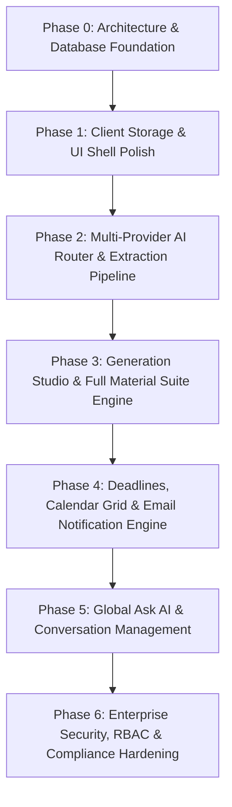

# eStudesk Enterprise — Phase-by-Phase Implementation Plan

## Executive Overview

**eStudesk** is a privacy-first, enterprise-grade study preparation platform designed to turn source materials (PDFs, audio, notes, URLs, images) into structured study materials (Notes, Cheatsheets, Infographics, Flashcards, Quizzes, Assignments, Presentations) in one click.

This document outlines the **deep-dive architectural evaluation of the existing codebase** against the **eStudesk Enterprise Master Prompt v4 Specification** and provides a **rigorous 7-Phase Implementation Blueprint** to bring the platform to 100% production readiness.

---

## Part 1: Deep Dive Codebase Analysis

### 1. Architectural Alignment & Current State

| System Layer | Master Prompt Specification | Current Codebase Implementation | Gaps & Work Required |
| :--- | :--- | :--- | :--- |
| **Frontend Framework** | React 19 + TypeScript 5 + Vite (Strict mode, custom design tokens, Tailwind CSS) | React 18 + Vite + Tailwind CSS + Lucide Icons | Upgrade React / TS configuration to strict zero-`any` compliance; refine typography (Serif headings + Sans body). |
| **Client Storage** | IndexedDB via Dexie.js (offline queue, drafts, conversations, attachments) | Dexie.js `EstudeskDB` (v2 schema) covering semesters, subjects, materials, messages, deadlines, conversations | Expand schema to handle offline event queue, versions, and source extraction caches. |
| **Backend & API** | Cloudflare Workers + Hono framework with strict Zod validation | Pure client-side SPA with mock generators | Create backend Cloudflare Worker service (`apps/api`) with Hono routing & middleware. |
| **Database & ORM** | Neon Postgres + Drizzle ORM (`@neondatabase/serverless` HTTP driver) | Local Dexie.js database only | Setup Drizzle schema (17 tables), migrations pipeline, and serverless DB pooling. |
| **Auth & Security** | Self-hosted Better Auth in Cloudflare Worker with Drizzle adapter, scrypt, RBAC, session revocation | Client mock state | Implement Better Auth endpoints, session middleware, cookie management, and RBAC (`student`/`admin`/`owner`). |
| **AI Infrastructure** | Multi-provider router (DeepSeek, Mistral, Gemini, OpenAI, MiMo, Moonshot) with forced Zod tool calling & circuit breakers | Simulated streaming & front-end placeholder response generators | Build AI Router micro-service with spend ceiling & failure rate circuit breakers. |
| **File Storage** | Cloudflare R2 with automatic file purging retention window (24h - 7d) | Local state file object URLs | Implement R2 upload presigned URLs and text extraction background pipeline. |
| **Email & Notifications** | Amazon SES (primary) + Zoho ZeptoMail (fallback), Durable Object queue, Handlebars templates | Client-side export (.txt / .pdf generation using `jspdf`) | Build email delivery engine, cron workers for digests/alerts, and webhook listeners for bounces. |

---

### 2. Module-by-Module Code Analysis

#### A. Data Models & Store (`src/types/index.ts`, `src/db/database.ts`, `src/store/appState.ts`)
- **Current State:** The client uses Dexie.js to persist `semesters`, `subjects`, `materials`, `messages`, `conversations`, `deadlines`, and `drafts`. Simple `useSyncExternalStore` handles global UI navigation state.
- **Strengths:** Clean Dexie versioning, reactive subscriptions via `useLiveQuery` in `useQueries.ts`.
- **Gaps:** Lacks backend server schema, version tracking on study materials (`material_versions`), audit logging, notification preference structures, and cost control telemetry tables.

#### B. Generation Studio (`src/components/GenerationStudio.tsx`)
- **Current State:** A full-screen overlay component (~76KB) with configuration forms for 7 material types, attachment handling, staged generation status UI, and a preview panel.
- **Strengths:** Excellent UI layout matching the Master Prompt specification for staged progress indicators.
- **Gaps:** Uses client mock response generators instead of server-sent events (SSE) or streaming WebSocket/Worker endpoints with forced Zod schemas.

#### C. Ask AI Panel & Global Search (`src/components/AskAIPanel.tsx`, `src/components/GlobalSearch.tsx`)
- **Current State:** 420px sliding panel on desktop / full-screen overlay on mobile. Supports chat context selection (subjects), attachments, and conversation history.
- **Strengths:** High fidelity to the two-panel calm design system.
- **Gaps:** Conversation history inline delete confirmation modal, per-chat TXT/JSON export, global import/export, and page context reader need complete integration.

#### D. Deadlines & Export Engine (`src/components/DeadlineTab.tsx`, `src/components/SemesterDashboard.tsx`, `src/utils/download.ts`)
- **Current State:** Urgent color coding implemented (`overdue`, `today`, `this_week`, `later`). Supports plain text and PDF downloads.
- **Gaps:** Lacks the Calendar Monthly Grid view component and backend email notification trigger system.

---

## Part 2: Phase-by-Phase Implementation Blueprint

---

### Phase 0: Architecture & Database Foundation
**Objective:** Establish the Cloudflare Worker backend, Neon Postgres database with Drizzle ORM, and Better Auth engine.

- [ ] **Backend Project Creation:** Initialize `apps/api` Cloudflare Worker with Hono web framework.
- [ ] **Drizzle ORM Schema:** Define the complete 17-table schema in `schema.ts`:
  - Identity & Auth: `users`, `user_roles`, `user_sessions`, `audit_logs`
  - Workspace Hierarchy: `folders` (Semesters), `subjects`
  - Study Materials: `materials`, `material_versions`, `extracted_sources`
  - Deadlines & Notifications: `deadlines`, `notification_preferences`, `notification_logs`, `email_templates`
  - Chat & Telemetry: `conversations`, `chat_messages`, `generation_events`
- [ ] **Database Migrations:** Run Drizzle kit migrations against Neon Postgres instance using `@neondatabase/serverless`.
- [ ] **Better Auth Setup:** Configure Better Auth in Hono Worker with Drizzle adapter, password hashing, and session management.
- [ ] **Design Tokens & Typography:** Refine `src/index.css` and `tailwind.config.js` to enforce ET Book / Source Serif 4 serif headings + Inter sans body.

---

### Phase 1: Client Storage & UI Shell Polish
**Objective:** Finalize offline-first Dexie.js client storage, keyboard navigation, and Semester/Subject CRUD capabilities.

- [ ] **Dexie v3 Schema:** Expand client IndexedDB schema for offline action queues, material version drafts, and local attachment cache.
- [ ] **Semester & Subject Management:**
  - Mandatory uppercase bold formatting for semester names (`tracking-widest`).
  - Three-dot dropdown menu with Pin/Unpin, Inline Rename, and Delete confirmation modals.
  - Custom color picker enforcing high contrast ratios for accessibility.
- [ ] **Bento Grid Semester Dashboard:** Build responsive asymmetric dashboard grid displaying upcoming deadline widgets, subject cards, and daily AI limit usage charts.

---

### Phase 2: Multi-Provider AI Router & Source Extraction Pipeline
**Objective:** Build server-side AI execution pipeline with strict Zod validation, fallback circuit breakers, and R2 document extraction.

- [ ] **OpenAI-Compatible AI Router:** Create provider adapters for DeepSeek, Mistral, Google Gemini, OpenAI, Xiaomi MiMo, and MoonshotAI.
- [ ] **Circuit Breakers & Budget Caps:**
  - Skip failing providers if error rate >5% in 5 minutes.
  - Implement per-provider and global daily spend limits.
- [ ] **Zod Forced Tool Calling:** Implement JSON Schema validation for all generation endpoints (`generate_notes`, `generate_cheatsheet`, `generate_infographic`, `generate_flashcards`, `generate_quiz`, `complete_assignment`, `generate_presentation`).
- [ ] **Source Processing Engine:**
  - Cloudflare R2 file bucket setup with presigned upload URLs.
  - Document text extraction for PDF, DOCX, TXT, CSV.
  - Tesseract OCR wrapper for images & Web Audio transcript processing.

---

### Phase 3: Generation Studio & Full Material Suite Engine
**Objective:** Connect front-end Generation Studio overlay to backend streaming AI endpoints and implement all 7 material renderers.

- [ ] **Generation Studio Overlay:** Staged progress indicators (*Analyzing sources → Structuring content → Generating draft → Finalizing*) with status updates.
- [ ] **7 Specialized Renderers:**
  - **Notes:** Structured Markdown with callouts, tables, and mnemonics.
  - **Cheatsheet:** KaTeX formula blocks, definition lists, multi-column print layout, hard 1-page word limits.
  - **Infographic:** Sandboxed DOMPurify iframe renderer (`sandbox="allow-scripts"`).
  - **Flashcards:** Interactive flip-card deck viewer with mastery tracking.
  - **Quiz Engine:** Single/multi-choice, short answer, instant grading, and explanation tooltips.
  - **Assignment Assistant:** APA/MLA formatted essay generator with mandatory academic disclaimer banner.
  - **Presentation Viewer:** Slide deck previewer with speaker notes.
- [ ] **Refinement Session Engine:** 10-turn capped refinement chat updating live previews with version history navigation arrows (← Version X of Y →).
- [ ] **Post-Save Summary Screen:** Show multi-material creation options allowing immediate generation of alternative material types from attached sources.

---

### Phase 4: Deadlines, Calendar Grid & Email Notification Engine
**Objective:** Build complete deadline tracking with monthly calendar views, PDF/TXT exports, and SES + ZeptoMail fallback email alerts.

- [ ] **Deadline View Extensions:**
  - Urgency categorization (`Overdue`, `Today`, `This Week`, `Later`).
  - **Calendar View:** Build full monthly interactive calendar grid with deadline chips and month navigation.
- [ ] **Export Enhancements:** Generate clean formatted `.txt` and styled `.pdf` summaries with dark header bars and category color blocks.
- [ ] **Email Delivery Engine:**
  - Cloudflare Durable Objects queue for rate-limited dispatching (max 14 emails/sec).
  - Primary provider Amazon SES (`@aws-sdk/client-sesv2`) + Zoho ZeptoMail HTTP fallback.
- [ ] **Background Cron Workers:**
  - **Weekly Digest:** Monday 8 AM timezone-aware cron rendering Handlebars templates.
  - **24h Deadline Alerts:** 15-minute background worker querying uncompleted upcoming deadlines.
- [ ] **Notification UI & Webhooks:** Build Settings Notification tab (toggles, time/day pickers, test email button) and handle SNS bounce/complaint webhooks.

---

### Phase 5: Global Ask AI & Conversation System
**Objective:** Deliver full-featured Ask AI panel with conversation history, page context reading, and export/import tools.

- [ ] **Global Ask AI Panel:** Slide-out 420px desktop drawer / full overlay with subject context chips, file upload menu, and suggested prompt buttons.
- [ ] **Chat History Sidebar:**
  - Conversations list with inline search and title editing.
  - Inline deletion modal ("Delete this conversation?").
  - Per-chat TXT (transcript) and JSON export.
  - Global JSON conversation import & export.
- [ ] **Page Context & Web Search:** Connect Tavily/Brave Search API toggle and client DOM page scraper context provider.
- [ ] **Save as Material:** Hover action on AI responses to immediately convert and store chat snippets into subject Study Notes.

---

### Phase 6: Enterprise Security, RBAC & Compliance Hardening
**Objective:** Finalize enterprise security, compliance features, audit logging, and quality gate certifications.

- [ ] **RBAC & Governance:** Enforce resource-scoped permissions (`student`, `admin`, `owner`) across all backend routes.
- [ ] **Audit Logging System:** Record all authentication, export, deletion, and permission actions to `audit_logs` table with viewer UI for admins.
- [ ] **GDPR Right to Erasure:** One-click account deletion trigger with 30-day grace period, soft deletion, and automated cryptographic data erasure.
- [ ] **Cost Control Hardening:** Server-side rate limiting (100 req/min auth, 1000 req/min API), daily tier generation limits, and `Idempotency-Key` UUID v4 header enforcement.
- [ ] **Accessibility & Performance Auditing:**
  - Pass WCAG 2.2 AA standards (keyboard focus traps, `aria-live` status regions, 4.5:1 contrast ratios).
  - Core Web Vitals target: LCP < 2.5s, FID < 100ms, CLS < 0.1, initial chunk < 200KB gzipped.

---

## Verification & Quality Gates

Each phase must satisfy the following criteria before deployment:

1. **Zod Validation:** All incoming request payloads validated against strict Zod schemas.
2. **Security & Sanitization:** HTML outputs sanitized via DOMPurify; no inline scripts.
3. **Audit & Telemetry:** Every mutation logs an audit event; AI invocations record token usage and cost metrics.
4. **Keyboard Accessibility:** All interactive elements accessible via `Tab` with visible focus rings.
5. **Mobile Responsiveness:** Tested on 375px mobile viewports up to 4K desktop screens.
